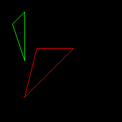

# 三角形绘制

> 本章节算法和代码引用了Dmitry V. Sokolov的tinyrenderer第二章三角形光栅化过程[@tinyrenderer2]。在原算法的基础上，本章节做了整理、改进和重构。感谢Dmitry V. Sokolov将这一段算法整理成册，并开源地发布在GitHub供所有人使用。

在上一章节中，我们描述了基本的线段绘制的算法。线段是所有直线，射线，以及曲线的基本构成单元。对于一条曲线来说，我们可以通过利用微积分的思想，将曲线转换为一条一条细小的线段，通过控制线段的数量来控制曲线的平滑精度。而对于一个曲面来说，我们则可以通过渲染无数个细小的三角形来拟合。

我们在此章节中，将会探索在2D平面下的三角形渲染。在掌握了2D三角形渲染的方法以后，对于一个立体的3D图形，无非通过投影变换将三维空间转换为二维平面，然后重复这个渲染过程。

## 空心三角形渲染

我们已经利用Bresenham算法实现了`DrawLine`函数，对于空心三角形的绘制，无非是三角形三个端点使用`DrawLine`进行三次线段绘制。

```{cc triangle-frame, file="code/03-triangle/triangle-frame.cpp", eval=FALSE}
```

运行该程序我们就可以得到一个空心三角形。



## 扫描线算法

通过线段绘制的办法，我们已经得到了一个空心的三角形。而对于实心三角形来说，一个朴素的想法是，我们从下至上，如同填色一样，一条线一条线的补全颜色，直到绘制完成整个三角形。

由于我们不断的在三角形内部从左至右扫描并填，这个算法被称之为扫描线算法。现在让我们来讨论扫描线算法的实现细节。

第一步，我们将三角形切分为上下两部分。


如上图所示，红色的三角形被经过B点的水平线，分成了上下两部分。上部分三角形由线段AC，BC和水平线BD围成，下半部分三角形则由AC，AB和水平线BD围成。A，B，C三点的确定只需要根据三角形的三个端点的y坐标从低到高排序即可。

如果A和B处于同一水平线，y值相等，那么我们可以认为其下半部分ABD（或上半部分BDC）为空三角形，而只存在上半部分（或下半部分）三角形。
 
经过如此切分以后，三角形的三条线段的方程都是已知的。那么我们关注三角形ABD，我们下往上，在线段AD上寻找一个点，然后做水平线，与AB相交，这条线段即我们的扫描线。这根扫描线明显处于三角形内部，那么我们把其经过的所有像素着色即可。

我们用C++代码来表述这一过程：

```{cc line-sweeping, file="code/03-triangle/line-sweeping.cpp", eval=FALSE}
```

运行代码得到


## 包围盒测试算法


